# System Dependency Matrix

> **Last Updated:** 2026-02-08 | **Purpose:** Bird's-eye view of internal dependencies within TagForge's monolithic architecture

---

## How to Read This

Unlike a multi-file project where dependencies are tracked via imports, TagForge is a single-file monolith. Dependencies here mean:

- **Rows** = the function/feature that *calls* something
- **Columns** = the function being *called*
- ● = direct call dependency

---

## Core Function Dependencies

Shows which TagForgePlugin methods call which other methods. Heavy columns = high-impact change targets.

| Caller → ↓ Calls | getRulesForPath | getTagsForPath | applyTagsToFile | removeAutoTagsFromFile | removeTagsFromFile | getFileTags | recordOperation | saveSettings | getParentFolder | folderNameToTag |
|---|---|---|---|---|---|---|---|---|---|---|
| **tagCurrentFile** | ● | | ● | | | ● | ● | | | |
| **handleFileCreate** | ● | | ● | | | ● | ● | | | |
| **handleFileRename** | | | | | | | | ● | ● | |
| **applyMoveRetag** | ● | | ● | ● | | ● | ● | ● | | |
| **revertAllAutoTags** | | | | ● | | ● | ● | ● | | |
| **revertAllTagsNuclear** | | | | | ● | ● | ● | ● | | |
| **revertFilesFromDates** | | | | ● | | ● | ● | ● | | |
| **revertAutoTagsByFolder** | | | | ● | | ● | ● | ● | | |
| **executeBulkApply** | | | ● | | ● | ● | ● | ● | | |
| **undoOperation** | | | ● | | ● | ● | | ● | | |
| **bulkApplyToFolder** | | | | | | | | | | |
| **getRulesForPath** | | | | | | | | | | ● |
| **getTagsForPath** | | | | | | | | | | ● |
| **applyTagsToFile** | | | | | | | | ● | | |
| **validateTags** | | | | | | | | | | |
| **fixValidationIssue** | | | | | | | | ● | | |

### Key Takeaways

| Highest Fan-In (most depended upon) | Call Count |
|---|---|
| **`getFileTags`** | 9 callers |
| **`saveSettings`** | 9 callers |
| **`recordOperation`** | 7 callers |
| **`applyTagsToFile`** | 5 callers |
| **`removeAutoTagsFromFile`** | 4 callers |
| **`getRulesForPath`** | 3 callers |
| **`folderNameToTag`** | 2 callers |

| Highest Fan-Out (most dependencies) | Call Count |
|---|---|
| **`applyMoveRetag`** | 6 functions |
| **`executeBulkApply`** | 6 functions |
| **`revertAllAutoTags`** | 4 functions |
| **`revertAllTagsNuclear`** | 4 functions |
| **`undoOperation`** | 4 functions |

> [!IMPORTANT]
> **`getFileTags`** and **`saveSettings`** are the most depended-upon functions. A bug in either affects nearly every feature. **`applyMoveRetag`** and **`executeBulkApply`** have the widest fan-out — they touch the most internal systems per invocation.

---

## Modal → Plugin Dependencies

Shows which plugin properties and methods each modal accesses.

| Modal | Plugin Properties | Plugin Methods | Notes |
|---|---|---|---|
| **BulkPreviewModal** | `settings`, `folderRules`, `tagTracking` | `getRulesForPath`, `getTagsForPath`, `saveSettings` | Heaviest modal — reads rules + tracking, can save rules |
| **RulesManagementModal** | `folderRules`, `settings`, `app` | `saveSettings`, `getRulesForPath`, `getTagsForPath` | CRUD for folder rules + applies rules to existing files |
| **TagForgeSettingTab** | `settings` | `saveSettings` | Standard settings read/write |
| **MoveConfirmationModal** | `settings` (via plugin) | `getRulesForPath`, `getTagsForPath` | Previews what tags will change |
| **GroupedMoveConfirmationModal** | `settings` (via plugin) | `getRulesForPath`, `getTagsForPath` | Same as above, for multiple files |
| **TagReportModal** | `tagTracking` | — | Read-only access to tracking data |
| **ValidationResultsModal** | — | `fixValidationIssue` | Triggers fixes via plugin |
| **UndoHistoryModal** | — | — | Receives data via constructor, calls back on undo |
| **DatePickerModal** | — | — | Pure UI — receives dates, returns selection |
| **FolderPickerModal** | — | — | Pure UI — receives folders, returns selection |

---

## Command → Function Call Chain

Shows the full call chain triggered by each user command.

| Command | Entry Point | → Calls | → Which Calls |
|---|---|---|---|
| **Tag Current File** | `tagCurrentFile` | `getRulesForPath` → `getFileTags` → `applyTagsToFile` → `recordOperation` | `folderNameToTag`, `applyFrontmatterTags`, `saveSettings` |
| **Revert All Auto-Tags** | `revertAllAutoTags` | `removeAutoTagsFromFile` → `getFileTags` → `recordOperation` → `saveSettings` | `processFrontMatter` |
| **Revert Nuclear** | `revertAllTagsNuclear` | `removeTagsFromFile` → `getFileTags` → `recordOperation` → `saveSettings` | `processFrontMatter` |
| **Revert by Date** | `revertAutoTagsByDate` | → `DatePickerModal` → `revertFilesFromDates` | `removeAutoTagsFromFile` → `saveSettings` |
| **Revert by Folder** | `revertAutoTagsByFolder` | → `FolderPickerModal` → `removeAutoTagsFromFile` | `getFileTags` → `recordOperation` → `saveSettings` |
| **Bulk Apply (Vault)** | `bulkApplyTags` | `generateEnhancedPreview` → `BulkPreviewModal` → `executeBulkApply` | `applyTagsToFile`, `removeTagsFromFile`, `recordOperation` |
| **Bulk Apply (Folder)** | `bulkApplyToFolder` | → `FolderPickerModal` → `generateEnhancedPreview` → `BulkPreviewModal` | → `executeBulkApply` |
| **Undo** | `showUndoHistory` | → `UndoHistoryModal` → `undoOperation` | `getFileTags`, `removeTagsFromFile`, `applyTagsToFile` |
| **Tag Report** | `showTagReport` | → `TagReportModal` | Reads `tagTracking` + vault metadata cache |
| **Validate** | `validateTags` | → `ValidationResultsModal` → `fixValidationIssue` | `saveSettings` |

---

## Event → Function Call Chain

| Event | Handler | → Calls |
|---|---|---|
| **File Create** | `handleFileCreate` | `getRulesForPath` → `applyTagsToFile` → `getFileTags` → `recordOperation` |
| **File Rename** | `handleFileRename` | `getParentFolder` → (branch) → `applyMoveRetag` OR `showBatchedMoveModal` → Modal → `handleMoveResult` / `handleGroupedMoveResult` |

---

## Data Flow Diagram

```mermaid
graph TD
    subgraph "User Actions"
        CMD["Commands (10)"]
        RIB["Ribbon Icons (2)"]
    end

    subgraph "Events"
        CRE["vault.on('create')"]
        REN["vault.on('rename')"]
    end

    subgraph "Tag Resolution"
        GRP["getRulesForPath"]
        GTP["getTagsForPath"]
        FNT["folderNameToTag"]
        HRP["hasRulesForPath"]
    end

    subgraph "Tag Operations"
        ATF["applyTagsToFile"]
        AFT["applyFrontmatterTags"]
        RAF["removeAutoTagsFromFile"]
        RTF["removeTagsFromFile"]
    end

    subgraph "Orchestrators"
        TCF["tagCurrentFile"]
        HFC["handleFileCreate"]
        HFR["handleFileRename"]
        AMR["applyMoveRetag"]
        EBA["executeBulkApply"]
        RAA["revertAllAutoTags"]
        UOP["undoOperation"]
    end

    subgraph "Data Layer"
        GFT["getFileTags"]
        ROP["recordOperation"]
        SS["saveSettings"]
        TT[("tagTracking")]
        OH[("operationHistory")]
        FR[("folderRules")]
    end

    subgraph "UI (Modals)"
        BPM["BulkPreviewModal"]
        RMM["RulesManagementModal"]
        MCM["MoveConfirmationModal"]
        GMCM["GroupedMoveConfirmationModal"]
        UHM["UndoHistoryModal"]
        TRM["TagReportModal"]
        VRM["ValidationResultsModal"]
    end

    CMD --> TCF & RAA & EBA & UOP
    RIB --> UOP & EBA
    CRE --> HFC
    REN --> HFR

    TCF --> GRP & ATF & GFT & ROP
    HFC --> GRP & ATF & GFT & ROP
    HFR --> AMR & MCM & GMCM
    AMR --> GRP & ATF & RAF & GFT & ROP & SS
    EBA --> ATF & RTF & GFT & ROP & SS
    RAA --> RAF & GFT & ROP & SS
    UOP --> ATF & RTF & GFT & SS

    GRP --> FNT
    GTP --> FNT
    ATF --> AFT & SS

    BPM --> GRP & GTP & FR
    RMM --> FR & SS
    MCM --> GRP & GTP
    GMCM --> GRP & GTP
    TRM --> TT
    VRM -.-> SS
```

---

## Feature Area Coupling

Shows how feature areas depend on each other. Higher coupling = higher risk of cross-feature bugs.

| Feature Area | Depends On | Depended On By |
|---|---|---|
| **Tag Resolution** (getRulesForPath, getTagsForPath) | folderRules data, folderNameToTag | Auto-tag, Manual tag, Move handling, Bulk ops, Modals |
| **Tag Application** (applyTagsToFile, applyFrontmatterTags) | saveSettings | Manual tag, Auto-tag, Move handling, Bulk ops, Undo |
| **Tag Removal** (removeAutoTagsFromFile, removeTagsFromFile) | saveSettings, processFrontMatter | Move handling, Revert ops, Bulk ops, Undo |
| **File Move Handling** | Tag Resolution, Tag Application, Tag Removal, History, Settings | — (top-level) |
| **Revert Operations** | Tag Removal, History, Settings | — (top-level) |
| **Bulk Operations** | Tag Resolution, Tag Application, Tag Removal, History, Settings | — (top-level) |
| **History / Undo** (recordOperation, undoOperation) | Tag Application, Tag Removal, Settings | Move handling, Revert, Bulk ops, Auto-tag, Manual tag |
| **Validation** | tagTracking data, saveSettings | — (standalone) |
| **Reporting** | tagTracking data, vault metadata | — (standalone) |
| **Settings / Data** (load, save, tagTracking) | Obsidian loadData/saveData | **Everything** |

---

## Blast Radius Analysis

If you change one of these core functions, here's what could break:

| Function Changed | Downstream Impact | Risk |
|---|---|---|
| **`saveSettings`** | Every feature that persists data (all 9 callers) | 🔴 Critical |
| **`getFileTags`** | Every feature that reads current tags (9 callers) | 🔴 Critical |
| **`getRulesForPath`** | All tag application: auto-tag, manual tag, move retag, bulk preview | 🔴 Critical |
| **`recordOperation`** | All undo capability (7 callers) | 🟠 High |
| **`applyTagsToFile`** | All tag writes: manual, auto, move, bulk, undo | 🟠 High |
| **`removeAutoTagsFromFile`** | Move retag, all revert operations | 🟠 High |
| **`folderNameToTag`** | Tag resolution (2 callers, but affects all tag names) | 🟡 Medium |
| **`applyFrontmatterTags`** | Only called by `applyTagsToFile` — isolated | 🟢 Low |
| **`getParentFolder`** | Only called by `handleFileRename` — isolated | 🟢 Low |
| **`generateOperationId`** | Only called by `recordOperation` — isolated | 🟢 Low |

---

## Structural Observations

> [!NOTE]
> **No circular dependencies exist** — the call graph is a clean DAG (directed acyclic graph). This is a positive architectural property despite the monolithic file structure.

> [!WARNING]
> **Settings is a shared mutable singleton.** All features read/write `this.settings`, `this.tagTracking`, `this.folderRules`, and `this.operationHistory` through the same object. There is no data access layer or validation boundary — any method can modify anything.

> [!TIP]
> If decomposition is planned, the natural module boundaries are:
> 1. **Tag Resolution** — `getRulesForPath`, `getTagsForPath`, `folderNameToTag`, `hasRulesForPath` (pure logic, no side effects)
> 2. **Tag IO** — `applyTagsToFile`, `applyFrontmatterTags`, `removeAutoTagsFromFile`, `removeTagsFromFile`, `getFileTags` (Obsidian API interaction)
> 3. **History** — `recordOperation`, `undoOperation`, `generateOperationId` (operation tracking)
> 4. **Modals** — Each modal class is already self-contained and could be a separate file
